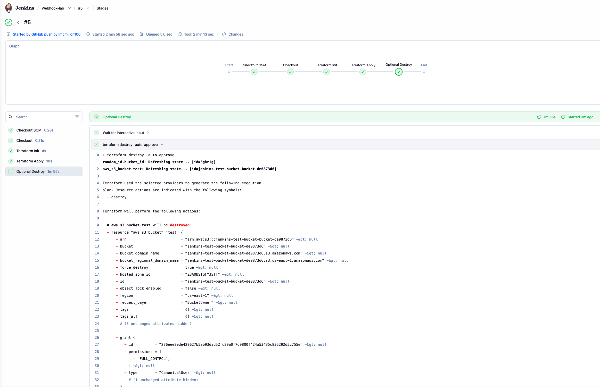
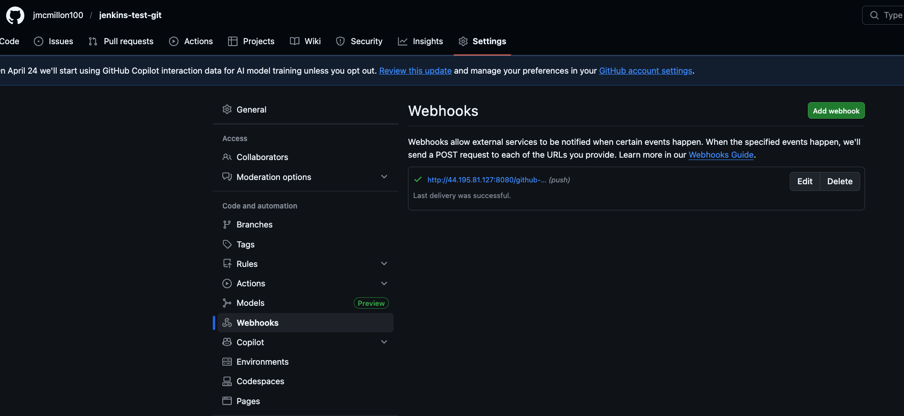
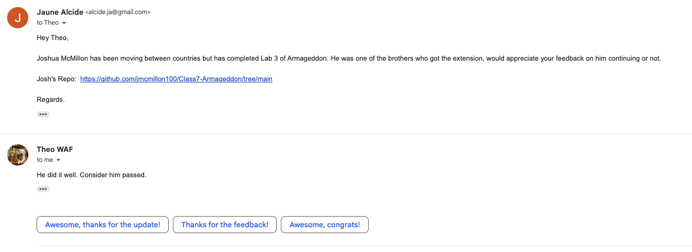

## Jenkins - Github via GitHub Webhook
---
This simple excersise that illustrated the possible integration between Jenkins and GitHub using a webhook.

The [images](./images/) folder contains images with proof of:
- screenshot: working webhook trigger (empty or otherwise)
- screenshot: successful TF deployment via jenkins
- screenshot: theo's blessing of Armageddon submission
- text file/markdown/picture: Armageddon repo link
- all text/image files uploaded in s3 bucket

The [0.More_information](./0.More_information) file contains, the [Armageddon_repo](./0.More_information/Armageddon_repo.md) and the [creating_custom_jenkins_image](./0.More_information/creating_custom_jenkins_image.md) files.

### Proofs:

- screenshot: working webhook trigger (empty or otherwise) & successful TF deployment via jenkins

- WebHook Payload Delivery:

---

- screenshot: theo's approval of Armageddon submission

---
---

- Armageddon repo link: [Armageddon repo](./More_information/armageddon_repo_link.md)

---
## Evidence Files

All evidence files are hosted in a publicly accessible S3 bucket.

deliverables_bucket = "jenkins-armageddon-submission-bucket"

readme_url = <"https://jenkins-armageddon-submission-bucket.s3.amazonaws.com/armageddon.md">

stage_view_url = <"https://class-7-gutcheck-20260329032009227600000001.s3.us-east-1.amazonaws.com/screenshots/03-stage-view.png">      

tf_success_url = <"https://class-7-gutcheck-20260329032009227600000001.s3.us-east-1.amazonaws.com/screenshots/02-terraform-success.png">

theo_approval_url = <"https://class-7-gutcheck-20260329032009227600000001.s3.us-east-1.amazonaws.com/screenshots/04-theo-approval.png"> 

webhook_trigger_url = <"https://jenkins-armageddon-submission-bucket.s3.amazonaws.com/Webhook_Delivery.png">