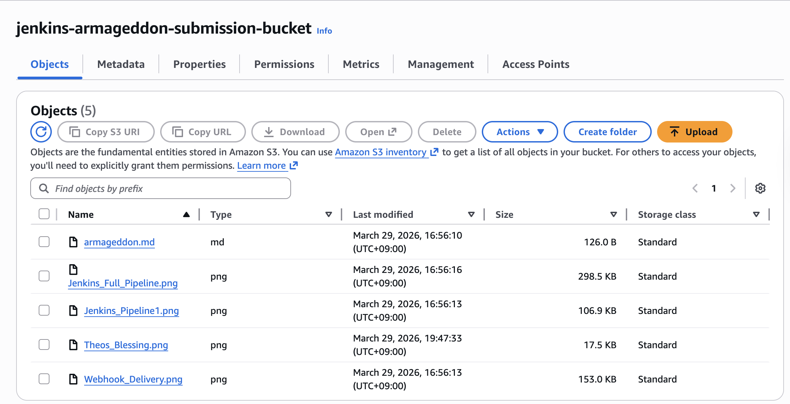

## Jenkins - Github via GitHub Webhook
---
This simple excersise that illustrated the possible integration between Jenkins and GitHub using a webhook.

The [images](./images/) folder contains images with proof of:
- screenshot: working webhook trigger (empty or otherwise)
- screenshot: successful TF deployment via jenkins
- screenshot: theo's blessing of Armageddon submission
- text file/markdown/picture: Armageddon repo link
- all text/image files uploaded in s3 bucket

The [More_information](./More_information) file contains, the [armageddon_repo_link](./More_information/armageddon_repo_link.md) file.

### Proofs:

- screenshot: working webhook trigger (empty or otherwise) & successful TF deployment via jenkins

- WebHook Payload Delivery:

---

- screenshot: Theo's approval of Armageddon submission

---
---

- Armageddon repo link: [Armageddon repo](./More_information/armageddon_repo_link.md)

- screenshot: Objects in S3 Bucket

---

---
## Evidence Files

All evidence files are hosted in a publicly accessible S3 bucket.

- Deliverables bucket: `jenkins-armageddon-submission-bucket`
- README: [armageddon.md](https://jenkins-armageddon-submission-bucket.s3.amazonaws.com/armageddon.md)
- Terraform success screenshot: [Jenkins_Pipeline1.png](https://jenkins-armageddon-submission-bucket.s3.amazonaws.com/Jenkins_Pipeline1.png)
- Theo Blessing screenshot: [theos_blessing.png](https://jenkins-armageddon-submission-bucket.s3.amazonaws.com/Theos_Blessing.png)
- Webhook trigger screenshot: [Webhook_Delivery.png](https://jenkins-armageddon-submission-bucket.s3.amazonaws.com/Webhook_Delivery.png)
- S3 Bucket objects screenshot: [S3Bucket_Objects.png](https://jenkins-armageddon-submission-bucket.s3.amazonaws.com/S3Bucket_Objects.png)